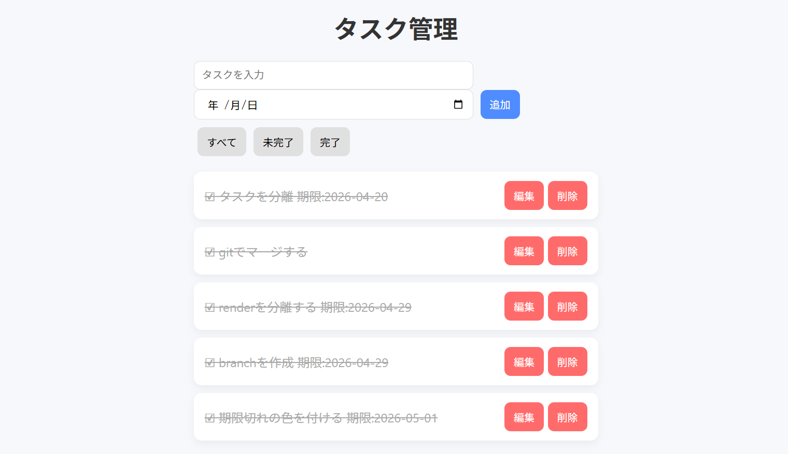

# タスク管理アプリ（Todo App）

## アプリURL
https://omiu-de-ta.github.io/todo-app/

----

## アプリ画面

----

## 概要
本アプリは、タスクの状態管理（完了 / 未完了）とフィルタリング機能を備えたタスク管理アプリです。

前回の開発では単純なCRUD処理に留まっていましたが、機能追加を進める中でコードの修正範囲が広がり、「どこを直せばいいのか分からなくなる」問題に直面しました。そこで、本アプリでは状態管理とUIの分離を意識した設計に取り組みました。

開発を進める中で、機能追加に伴いコードの可読性と保守性が低下する問題に直面し、それを解決するために設計の見直しを行いました。

----

## 技術選定
本アプリでは JavaScript（Vanilla JS） を採用しています。

フレームワークを使用すれば状態管理は簡潔に実装できますが、今回は以下の理由からあえて使用しませんでした。

- 状態管理やデータフローの仕組みを自分で設計・実装するため
- フレームワークに依存しない設計力を身につけるため

その結果、データの流れとUI更新の関係を明確に理解することができました。

----

## 設計
本アプリでは「データ管理」と「UI操作の分離」を重視して設計しました。

### 課題
初期実装では、データ操作とUI描画が混在しており、以下の問題が発生しました。

* どこでデータが変更されているか分かりにくい
* 機能追加のたびにrender関数が肥大化する
* 修正時に他の処理へ影響が出る

### 改善
これらの課題を解決するため、債務ごとに処理をわけることを意識し、
データ管理とUIの分離を行いました。

- TaskManager：データの追加・削除・編集・タスクの状態管理
- Storage ：データの保存・読み込み
- render：UIの描画のみ担当

また、処理の流れを以下のように統一しました。

1. ユーザー操作
2. データ更新（TaskManager）
3. localStorageに保存
4. renderで再描画

この一方向のデータフローにすることで、状態とUIの整合性を保つ設計にしています。

### 設計時に意識した点
1. TaskManagerとStorageの作成において
TTaskManagerとStorageの責務分離において、
「どこまでをデータ管理に含めるか」で迷い、設計が一度崩れました。

特に、保存処理をどこに持たせるかが曖昧になり、
責務の境界が不明確になる問題がありました。

最終的に、

* データの変更はTaskManager
* 永続化はStorage

と役割を明確に分離することで解決しました。

2. renderの設計において
機能追加に伴いrender関数が肥大化したため、以下の単位で分割しました。

- render
- createTaskItem
- createNormalUI
- createEditUI
- createButtonGroup

分割する際には、

- 分割しすぎると可読性が下がる
- まとめすぎると責務が曖昧になる

というトレードオフを考慮し、1つの関数に1つの責務を意識して設計しました。

###　苦労した点
1. データ更新とUI更新の切り分け
イベント処理の中で、

- renderを呼ぶべきか
- updateUIを呼ぶべきか

の判断が曖昧で、
修正のたびに表示が崩れる問題が発生しました。

整理した結果、

- データ変更がある場合 → updateUI
- UIのみ変更する場合 → render

と使い分けることで、処理の責務を明確にしました。

2. 状態とUIの不整合
タスク追加後にフィルター条件によって表示されない問題が発生しました。

これに対して、タスク追加時にフィルターを「すべて」に戻すことで、
ユーザー体験の一貫性を保つように改善しました。

3. 異常系への対応
- 空入力時のバリデーション
- localStorageのデータ破損時の例外処理（try-catch）
を実装し、異常な入力や状態でもアプリが破綻しないようにしました。

---

## 設計図

UI → render → TaskManager → Storage → localStorage

---

## 機能
* タスクの追加 / 削除 / 編集
* 完了 / 未完了の切り替え
* フィルター機能（すべて / 未完了 / 完了）
* localStorageによるデータ永続化
* 期限設定
* 期限に応じた表示変更

----

## 使用技術
HTML / CSS / JavaScript（Vanilla JS） / localStorage

----

## 工夫した点
* フィルター機能により状態ごとのタスク管理を可能にした
* 期限に応じて色を変えることで視認性を向上させた
* UI操作とデータ操作を分離し、保守性を向上させた
* データの流れを統一することで不整合を防いだ

----

## 今後の改善
* Reactでの再実装（コンポーネント設計への応用）
* 並び替え機能の追加によるタスクの柔軟な管理
* キーボード操作への対応にってユーザーが操作しやすいようする
